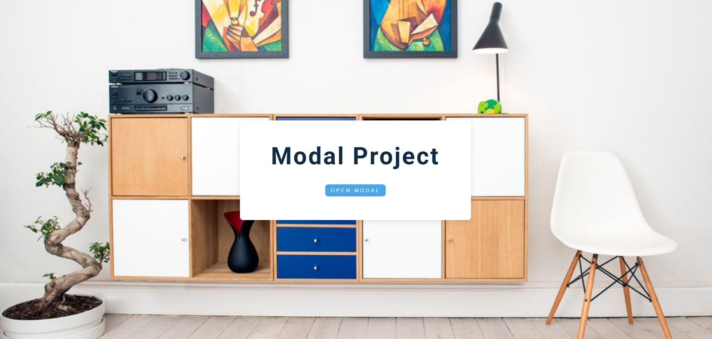

# Modal

This repository created for training and understanding Javascript principle. While doing that you will practice CSS and DOM Manipulation.

## Setup
- [Live Server](https://marketplace.visualstudio.com/items?itemName=ritwickdey.LiveServer) Extension is compulsory!

```
- cd "project-folder"
- open the html file with Live-Server
```

## About the App

<p class="has-line-data" data-line-start="10" data-line-end="11"> Modal Project Implementation Example. </p>


## Usecase of the App
